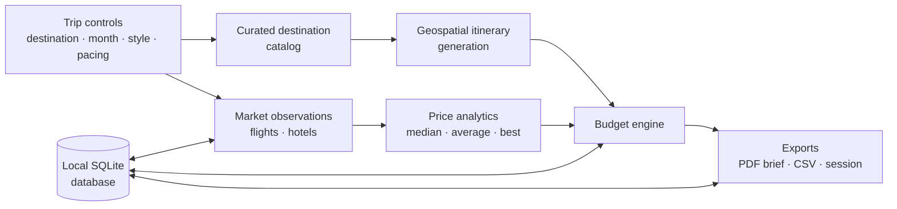
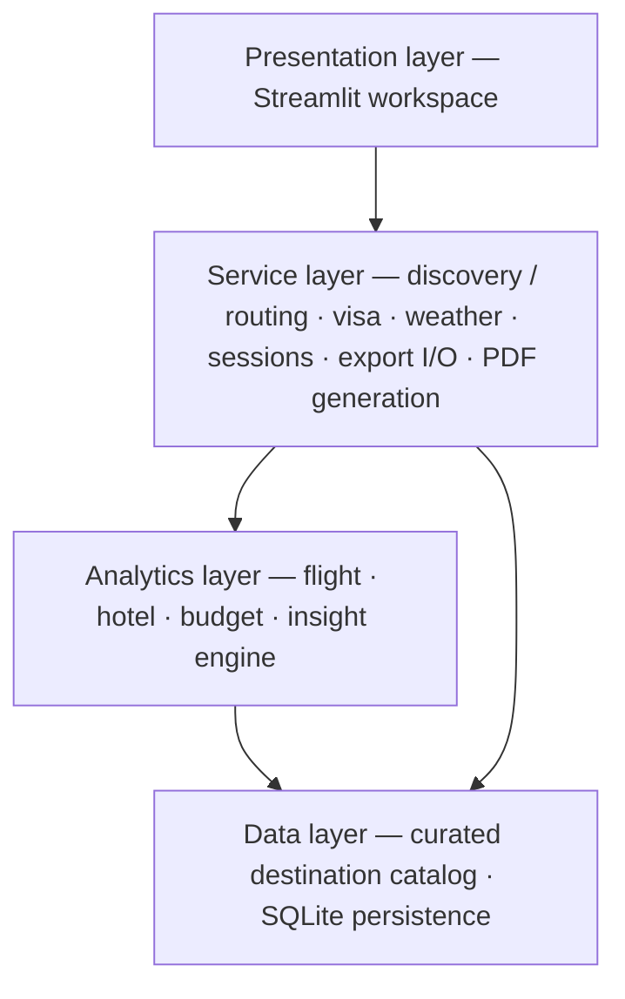

# Trimate

**A local-first travel intelligence workspace — turn scattered trip research into a routed, budgeted, exportable plan.**

-003B57?logo=sqlite&logoColor=white)

---

> **About this repository** — This repository hosts the product documentation for Trimate.
> The application source code is proprietary and is **not** distributed here.
> See [License & source availability](#license--source-availability) below.

---

## The problem

Planning a serious trip means juggling a dozen browser tabs: flight prices you saw yesterday and can't find today, hotel shortlists buried in notes apps, visa rules on government sites, and a budget spreadsheet that never quite adds up. The research exists — it just isn't *organized as data*.

Trimate treats trip planning as an analytics problem: **observations in, decisions out.** You log what you actually see in the market (fares, nightly rates); Trimate aggregates it into medians, best-available rates, routed itineraries, and a defensible master budget — all stored locally on your machine, with no accounts and no cloud dependency.

## What it does

Trimate is a Streamlit-based workspace organized around seven working surfaces:

| Surface | What you do there |
|---|---|
| **Dashboard** | High-level trip insights, a curated destination explorer, and a route map preview at a glance. |
| **Flights reviewed** | Capture every fare you encounter — route, airline, duration, price — and get median / average / best-available analytics back. |
| **Hotels reviewed** | Log candidate properties with star rating, area, cancellation policy, and nightly rate; filter the board to your shortlist. |
| **Entry + safety** | Passport-aware entry requirements plus safety and seasonal weather signals for the destination. |
| **Route planner** | Auto-generated day-by-day itineraries with segment distances and realistic transfer times, tuned by pacing mode. |
| **Budget engine** | Your observed market data, tiered daily allowances, and a risk-scaled contingency buffer rolled into one master trip budget. |
| **Collaboration + reports** | Export a polished PDF trip brief, share raw CSVs or the underlying database, and restore saved trip sessions. |

## How it works

Every trip starts from the sidebar: pick a destination, passport country, travel month, trip style, and pacing mode. Trimate generates a routed itinerary from its curated destination catalog, you feed it real market observations as you research, and the budget engine keeps a live, fully-derived cost picture until you're ready to export the plan.

## Design principles

- **Local-first, private by default.** All data lives in an embedded SQLite database on your machine. Nothing is uploaded anywhere.
- **Observed prices beat scraped guesses.** Analytics are built from fares and rates *you actually saw*, timestamped and queryable — not from third-party estimates.
- **Style-aware planning.** Six trip styles (Adventure, Culture, Food, Nature, Beach, Mixed) and three pacing modes (Slow, Balanced, Packed) shape both the itinerary structure and the daily-spend assumptions.
- **Honest budgeting.** The master budget separates observed costs, tiered daily allowances, and an explicit contingency buffer scaled to your risk tolerance — so you can see exactly where every number comes from.
- **Portable output.** A finished plan leaves the app as a polished PDF brief, raw CSVs, or a shareable database file — collaboration without a server.

## Architecture at a glance

Trimate is built as a set of decoupled layers behind a reactive Streamlit front end:

Route generation uses haversine great-circle distance modeling to derive segment distances and realistic transfer times between itinerary anchors. The full design is described in the [architecture overview](docs/architecture.md).

## Documentation

| Document | Contents |
|---|---|
| [Architecture overview](docs/architecture.md) | System layers, processing pipeline, data model, budget derivation, packaging. |
| [Feature tour](docs/feature-tour.md) | A guided walk through the sidebar and all seven workspace surfaces. |

## Technology

| Concern | Choice |
|---|---|
| Language | Python 3.9+ |
| UI framework | Streamlit (wide-layout reactive workspace) |
| Data handling | pandas |
| Visualization | Plotly · Matplotlib |
| Reporting | ReportLab (PDF brief generation) |
| Persistence | SQLite (embedded, local-first) |
| Distribution | PyInstaller (standalone Windows executable, no console) |

## Status

Trimate is under active development, currently at **revision 7.3** (developed under the working title *Travel Intelligence Workspace*). The revision history spans seven major iterations covering destination discovery, price analytics, geospatial routing, budget derivation, and report generation.

## License & source availability

The documentation in this repository is © 2026 Alonso Figueroa Villa and released under the [MIT License](LICENSE).

The Trimate **application source code is proprietary** and is not published in this repository. For inquiries about the application — demos, collaboration, or source access — reach out via [GitHub @AfiVill](https://github.com/AfiVill).
