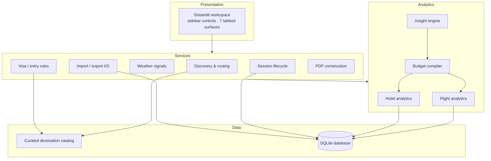

# Trimate — Architecture Overview

This document describes the system design of Trimate at a level intended for technical evaluation. It covers the layer model, the processing pipeline, the persistence design, and how the master budget is derived. Implementation details and source code are proprietary and intentionally out of scope.

## Contents

1. [System layers](#system-layers)
2. [Processing pipeline](#processing-pipeline)
3. [Data model](#data-model)
4. [Route generation](#route-generation)
5. [Budget derivation](#budget-derivation)
6. [Persistence & collaboration](#persistence--collaboration)
7. [Packaging & distribution](#packaging--distribution)
8. [Versioning](#versioning)

## System layers

Trimate is organized as four decoupled layers. Each layer only speaks to the one beneath it, which keeps the UI thin and the domain logic independently testable.

| Layer | Responsibility |
|---|---|
| **Presentation** | A wide-layout Streamlit workspace: sidebar trip controls, hotel filters, and seven tabbed working surfaces. Handles user input and reactive state only — no domain logic. |
| **Services** | The business-logic layer: geospatial discovery and routing, visa/entry rules, weather signals, session lifecycle, import/export I/O, and PDF document construction. |
| **Analytics** | Statistical aggregation over the observation logs: flight-fare analytics, hotel-rate analytics, budget compilation, and a cross-cutting insight engine that surfaces headline findings on the dashboard. |
| **Data** | A curated in-memory destination catalog (places, regions, activity anchors, and entry-requirement knowledge) plus the SQLite persistence layer. |

## Processing pipeline

A trip moves through the system in a fixed sequence:

1. **Trip initialization.** The traveler selects destination, passport country, travel month, trip style, budget level, risk tolerance, and pacing mode from the sidebar.
2. **Catalog load.** The curated catalog supplies destination anchors (places, regions, activities) and entry-requirement knowledge for the selected passport/destination pair.
3. **Itinerary generation.** The discovery service assembles a day-by-day route from the catalog anchors, shaped by trip style and pacing mode.
4. **Observation capture.** As the traveler researches, every fare and nightly rate they encounter is logged as a timestamped observation.
5. **Aggregation.** The analytics layer reduces observation logs to medians, averages, and best-available rates.
6. **Budget compilation.** Observed costs, tiered daily allowances, and a contingency buffer are compiled into the master budget.
7. **Export.** The finished plan leaves the system as a PDF brief, CSV extracts, or a shareable database file.

## Data model

All persistent state lives in a single embedded SQLite database with three core entities:

| Entity | Represents | Captures |
|---|---|---|
| **Flight reviews** | One observed airfare | Origin, destination, airline, flight duration, observed price, capture context. |
| **Hotel reviews** | One observed property rate | Property name, area, star rating, cancellation policy, nightly rate. |
| **Trip sessions** | One saved planning state | The full sidebar configuration — destination, month, budget level, pacing, and companions of the plan — so a session can be restored later. |

Observations are append-oriented: the analytics layer derives everything else (medians, bests, budget lines) at read time, so recorded market data is never mutated by downstream calculations.

## Route generation

The discovery service models each itinerary as a sequence of geospatial anchors drawn from the curated catalog. Distances between anchors are computed with **haversine great-circle mathematics**, then converted into realistic ground-transfer time estimates. Pacing mode (Slow / Balanced / Packed) governs how many anchors are scheduled per day and how much recovery buffer each day keeps; trip style biases which categories of anchors are selected (e.g. historic cores for Culture trips, coastal anchors for Beach trips).

## Budget derivation

The master budget is built from three separable components, kept explicit so the traveler can audit every line:

1. **Observed market costs** — the flight and lodging figures derived from the traveler's own logged observations.
2. **Daily allowances** — tiered per-day estimates for food, local transport, and activities, scaled by the selected budget level.
3. **Contingency buffer** — a percentage margin over the subtotal, scaled by the selected risk tolerance.

Because the components stay separate until final rollup, changing one input (a better fare, a different risk setting) recomputes the budget without disturbing the underlying observations.

## Persistence & collaboration

Trimate is deliberately **local-first**: there is no server, no account, and no network dependency for core planning. Collaboration works by moving the data, not by hosting it:

- **Database handoff** — the SQLite file is self-contained and can be shared directly with a co-planner.
- **CSV exchange** — observation logs can be exported to and imported from CSV.
- **PDF brief** — a ReportLab-generated document that packages the itinerary, analytics, and budget into a polished, shareable trip brief.

## Packaging & distribution

Beyond running as a Streamlit app from the Python environment, Trimate packages into a **standalone Windows executable** via PyInstaller (one-directory build, windowed, custom icon) — allowing distribution to travelers who have no Python installation at all.

## Versioning

Trimate advances in whole revisions (currently **V7.3**, developed under the working title *Travel Intelligence Workspace*). Each major revision has expanded one subsystem at a time — destination discovery, price analytics, geospatial routing, budget derivation, and report generation — keeping the layer boundaries stable across versions.
